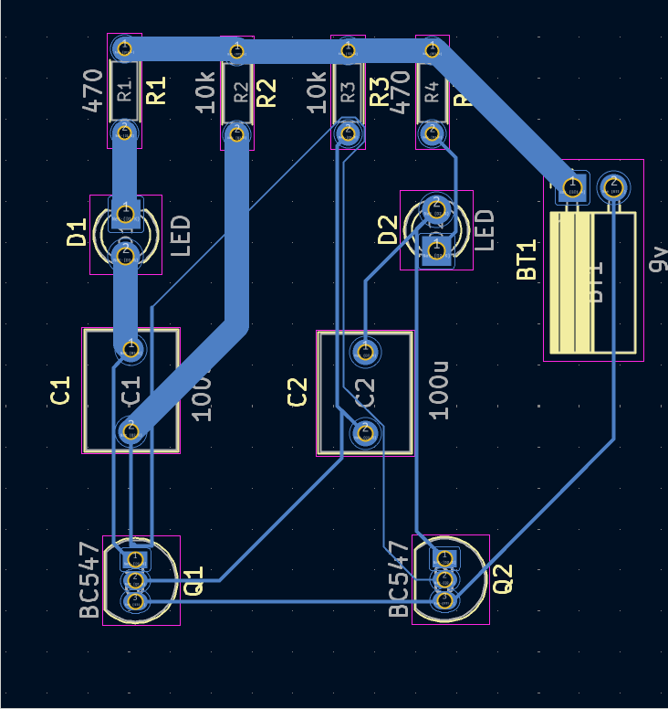

# KiCad İle Flip Flop Devresi Tasarımı

Bu çalışmada KiCad programında Flip Flop devresi tasarlanmıştır. GitHub Desktop kullanarak projeyi kolayca klonlayabilir, geliştirme yapabilir ve katkıda bulunabilirsiniz.

## 🚀 Başlarken

### 1. Bu projenin çalışması

Bu projede devrenin girişine uygulanan sinyal değişmediği sürece çıkış durumunun aynı şekilde korunması amaçlanmıştır.

### Devrenin PCB Tasarım Görüntüsü


### 2. Bu projeyi kendi bilgisayarınıza klonlayın

GitHub Desktop kullanıyorsanız:

1. "Code" butonuna tıklayın
2. "Open with GitHub Desktop" seçeneğini seçin
3. GitHub Desktop üzerinden dizini seçin ve "Clone" butonuna tıklayın

Alternatif olarak komut satırı ile:

```bash
git clone https://github.com/elif-karakaya/KiCad-Ile-Flip-Flop-Devresi-Tasarimi.git

